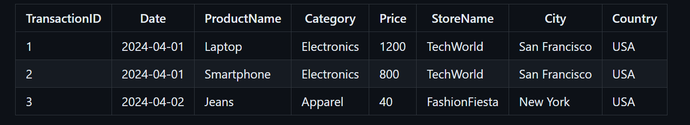

| TransactionID | Date       | ProductName | Category    | Price | StoreName     | City          | Country |
| ------------- | ---------- | ----------- | ----------- | ----- | ------------- | ------------- | ------- |
| 1             | 2024-04-01 | Laptop      | Electronics | 1200  | TechWorld     | San Francisco | USA     |
| 2             | 2024-04-01 | Smartphone  | Electronics | 800   | TechWorld     | San Francisco | USA     |
| 3             | 2024-04-02 | Jeans       | Apparel     | 40    | FashionFiesta | New York      | USA     |

> Lucidchart relation cheat sheet (Cardinality)


> TASK




> TASK 2


> Schema

- Reference codes

```sql
-- Schema
CREATE TABLE Actor (
	ActorId INT IDENTITY(201,1) PRIMARY KEY,
    Name VARCHAR(30) NOT NULL
);
CREATE TABLE Director (
					DirectorId INT IDENTITY(101,1) PRIMARY KEY,
					Name VARCHAR(30) NOT NULL
);

CREATE TABLE Movies (
					MovieId INT PRIMARY KEY IDENTITY(1,1),
					 Title VARCHAR(20) NOT NULL UNIQUE,
					 Year INT NOT NULL,
					 DirectorId INT,

					 CONSTRAINT Did_FK FOREIGN KEY (DirectorId)
					 REFERENCES Director(DirectorId)
)

CREATE TABLE MovieActors (MovieId INT,
						  ActorId INT,
						  CONSTRAINT PK_MovieActor PRIMARY KEY (MovieId, ActorId),
						  CONSTRAINT MovieActor_FK1 FOREIGN KEY (MovieId)
						  REFERENCES Movies(MovieId),
						  CONSTRAINT MovieActor_FK2 FOREIGN KEY (ActorId)
						  REFERENCES Actor(ActorId)
)


INSERT INTO Director VALUES
('S. S. Rajamouli'), ('Trivikram Srinivas'), ('	Puri Jagannadh'),
('Koratala Siva'),('Sandeep Reddy Vanga'),('Parasuram');


SELECT * FROM Director;

INSERT INTO Actor VALUES
('Prabhas'),('Allu Arjun'),('Mahesh Babu'),('Ram Charan'),
('Vijay Deverakonda'),('Jr. NTR'),('Nani'),('Pawan Kalyan');
SELECT * FROM Actor;

INSERT INTO Movies VALUES
('Baahubali',2015,101),
('AVPL',2020,102),
('Pokiri',2006,103),
('Magadheera',2009,101),
('Srimanthudu',2015,104),
('Arjun Reddy',2017,105),
('Geetha Govindam',2018,106),
('Temper',2015,103),
('Eega',2012,101),
('Attarintiki Daredi',2013,102);
SELECT * FROM Movies;

--DROP Table MovieActors
--DROP TABLE Movies
--DROP TABLE Actor
--DROP TABLE Director

SELECT * FROM Movies
SELECT * FROM Director
SELECT * FROM Actor
```
