> Database

- A special software to store data

> Why database ?

- To automatically fetch the data if available from RAM or else should fetch from hard disk.
- when there is a frequent (frequently asked data) request from user , the special software(database) copies the data from harddisk to RAM to make the things faster.
- Querying becomes easier
- CRUD - easy
- Backups are inbuilt
- Undo - easily (time limit)
- Performance

> Linux

- Linux : OS used in cloud
- Advatages of using Linux:
  1. Free
  2. Open-Source
  3. Secure
  4. Small footprint (size is less compared to other OS)
  5. Automation (everything can be operated using terminal)

distro(distributions) used in cloud: alpine (small footprint - 256 MB)

> Scaling

- vertical (Making PC powerful by upgrading RAM & proccessor)
- Horizontal (Adding more pc's)

> Types of databases

- SQL (Relational Databases)-> stored in tables (ex: PL/SQL , PostgreSQL , amazon RDS , MySQL)
- NoSQL (Non-Relational Databases) -> stored in documents (Ex: mongoDB , CouchDB , redis(helps in fast retrival of data) , cassandra(netflix uses this) , DynamoDB , neo4j )

> Problems due to duplicates in the table

- Storage issues (consumes more space) / DRY
- update anamoly

> Primary key

- unique
- cannot be NULL
- only one primary key per table

> Foreign key

- can be null
- primary key in other table
- join table

> Composite primary key

- when one item cannot be a primary key , we can combine 2 columns to make a primary key together this is known as Composite primary key

> Normalization

- to increase the safety
- Anamolies are eliminated

> 1NF

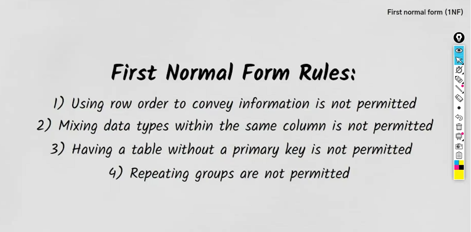

> Drawbacks of 1NF

- update anamoly
- Deletion anamoly
- Insertion anamoly

> 2NF


> 3NF


> Non-key Attribute

everything apart from primary key

> BCNF

Every attribute in a table should depend on the key , the whole key.

> Joins


> Foreign key constraints

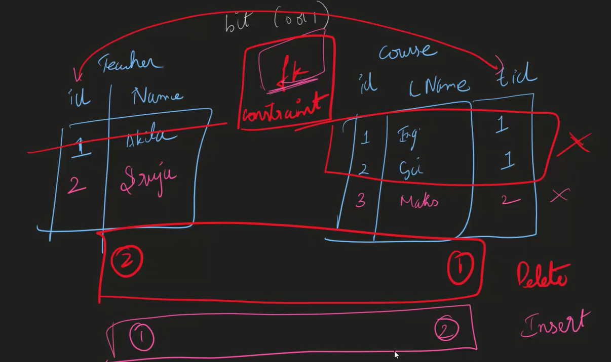

> Data Types

- Integer
  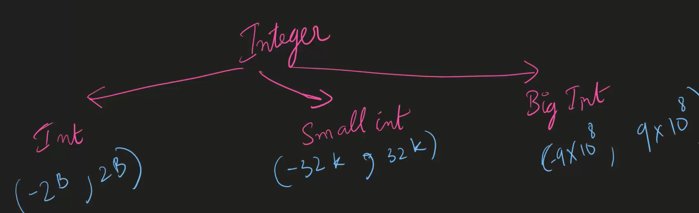

- String

  - Varchar
  - nvarchar (useful for other languages and special characters and symbols)
  - instead of varchar(Text) use varchar(max)

- Date

  - DateTime
  - Date
  - Time

- Decimal

  - decimal(exact)
  - float (approx)
    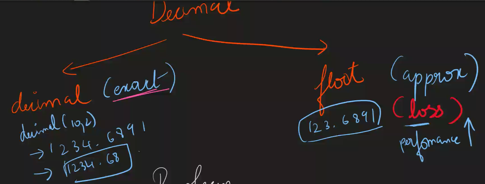

- Boolean -> bit (0/1)

> Functions

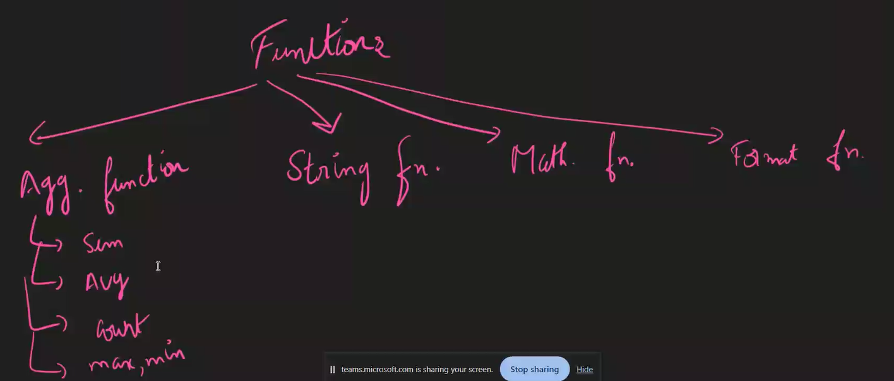

> String Functions

```sql
-- String Functions
-- 1. Len
Select Len ('Akhila') as NameLength

--2. Left
Select left ('Akhila' ,4) as NameLeft

-- 3. Right
Select Right ('Akhila' ,4) as NameRight

-- 4. Substring (starts with index 1)
Select Substring ('Akhila' ,2,4) as NameSubString

-- 5. Upper
Select Upper ('Akhila') as NameToUpper

-- 6. Lower
Select Lower ('AKHILA') as NameToLower

-- 7. Ltrim
Select Ltrim ('      Akhila     ') as NameToLtrim
Select Ltrim ('Akhila' , 'Ak') as NameToLtrim

-- 8. Rtrim
Select Rtrim ('      Akhila     ') as NameToRtrim
Select Rtrim ('Akhila' , 'la') as NameToRtrim

-- 9. CharIndex
Select CharIndex('cool' , 'This is cool') as NameToCharIndex

-- 10. Replace
Select Replace('This is fun day.Lets Enjoy the day','day','night') as NameReplace

-- 11. Concat
Select Concat ('Akhila',' Mucharla') as NameConcat

-- 12. Replicate -> Repeat
Select Replicate ('Akhila ',3) as NameReplicate

-- 13. Reverse
Select Reverse ('Akhila') as NameReverse
```

> Mathematical Functions

```sql
-- Mathematical Functions

-- 1. Abs (gives +ve value)
Select Abs(-5)

-- 2. Power
Select Power(2,4)

-- 3. Round
Select Round(67.42384 ,3)

-- 4. Ceiling
Select  Ceiling (67.42384)

-- 5. Floor
Select  Floor (67.42384)

```

> Date functions

```sql
-- Date Functions

-- 1. GetDate
Select GetDate() as Today

-- 2. DateAdd
Select DateAdd(day, 10,GetDate())

-- 3. DateDiff
Select DateDiff(day,'2024-01-01','2024-06-13')
Select DateDiff(month,'2024-01-01','2024-06-13')
Select DateDiff(year,'2024-01-01','2024-06-13')
Select DateDiff(hour,'2024-01-01','2024-06-13')

-- 4. Format
Select Format(GetDate(), 'dd MM yyyy')
Select Format(GetDate(), 'dd MMM yyyy')
Select Format(GetDate(), 'dd MMMM yyyy')

-- 5. DatePart (Extracts the part from the date)
Select DatePart(month, GetDate())
Select DatePart(day, GetDate())
Select DatePart(year, GetDate())
```

> Set operators

- intersection (A n B)
- union (A U B)
- union all
- Except (A-B)

> Multi level Grouping

```sql
Select region,product_type,sum(sales_amount) from sales_data
Group by region, product_type
```

> Multi level ordering

```sql
Select region,product_type,sum(sales_amount) from sales_data
Group by region, product_type
order by region,product_type desc
```

> Grouping sets

```sql
Select region,product_type,sum(sales_amount) from sales_data
Group by GROUPING SETS(
                        (region),
                        (product_type),
                        (region,product_type)
                      )
```

> Rollup vs Cube

- cube gives all the possible combinations, where as rollup gives limited combinations
- Roll up : if `n` columns -> `n+1` combinations
- Cube : if `n` columns -> `2^n` combinations

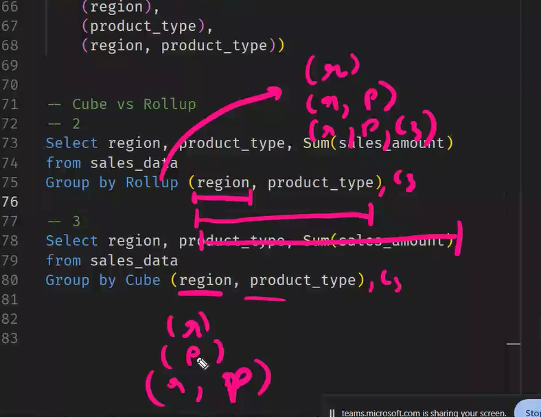
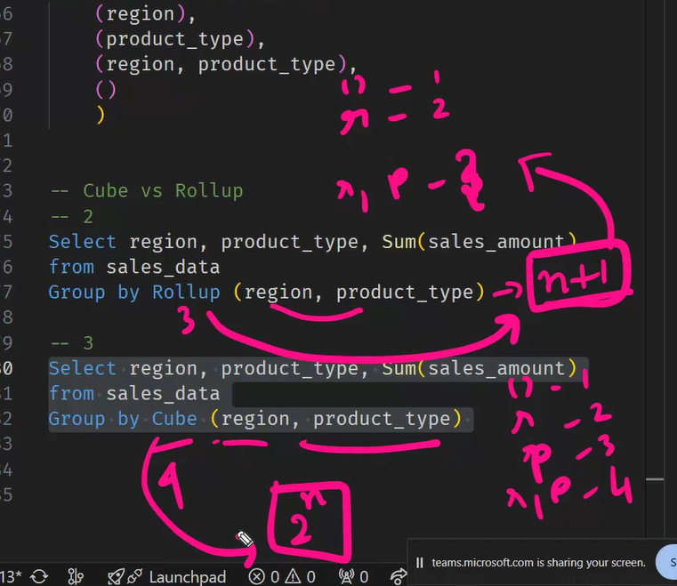

> Ranking Functions

- 1. Rank
- 2. Dense_Rank
- 3. Row_Number

> Database Keys

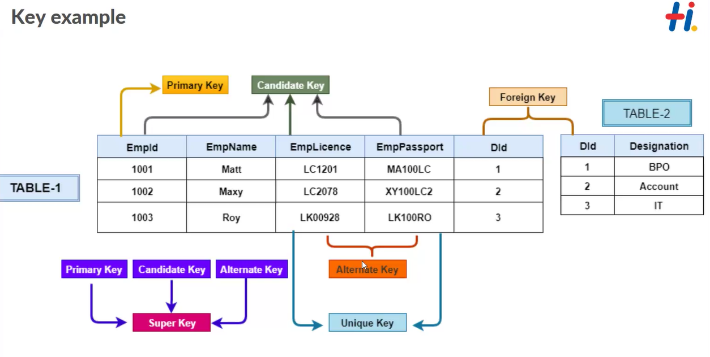
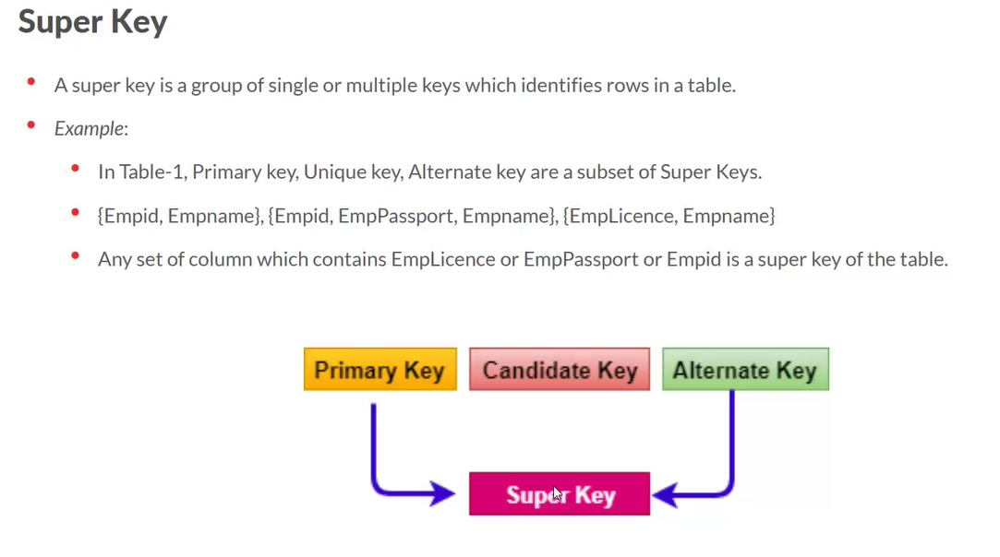

> JOINS

- Cross Join
  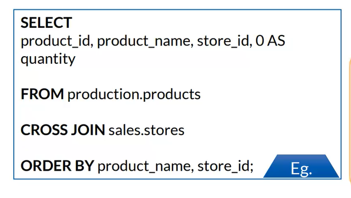

- Types of inner join

  - Natural join(no need to specify the condition)

    - 

  - Equi join (condition should be always equal to(=))

    - 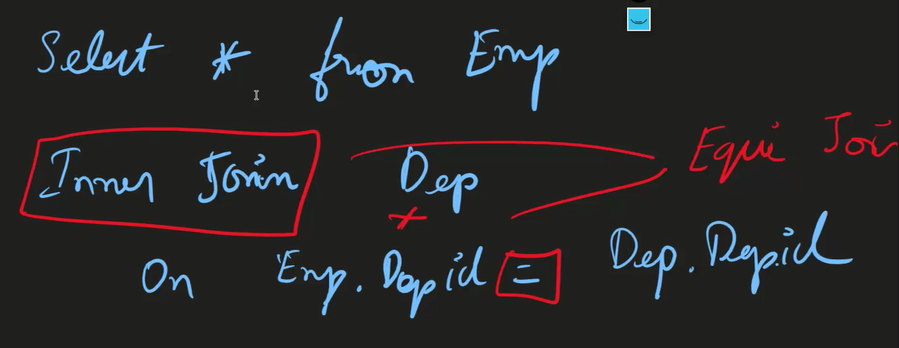
    - Difference between natural and equi join
    - 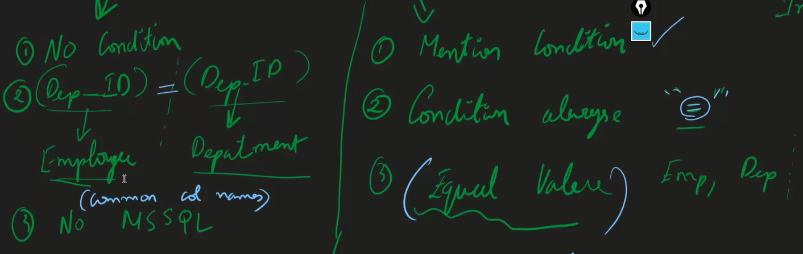

  - Inner join
    - can specify any condition (<,>)

- Self join

> Functions

- returns a scalar value (string,value,int,table)

> Indexing

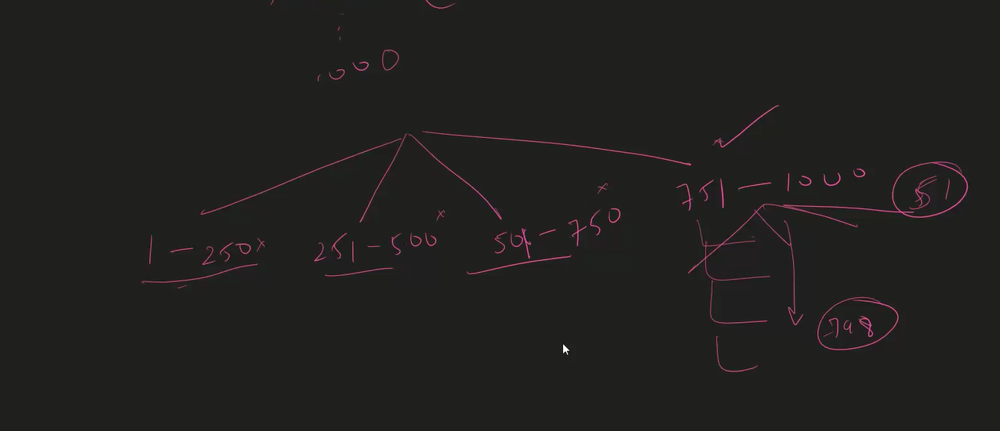

- If the indexing is not done, then we need to search one by one . this process is known as `Table Scan`.
- Default index which we have in database is called `Clussterred index`
