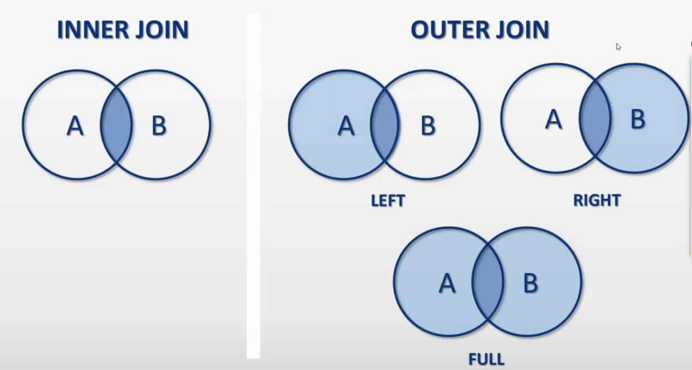

> Database

- A special software to store data

> Why database ?

- To automatically fetch the data if available from RAM or else should fetch from hard disk.
- when there is a frequent (frequently asked data) request from user , the special software(database) copies the data from harddisk to RAM to make the things faster.
- Querying becomes easier
- CRUD - easy
- Backups are inbuilt
- Undo - easily (time limit)
- Performance

> Linux

- Linux : OS used in cloud
- Advatages of using Linux:
  1. Free
  2. Open-Source
  3. Secure
  4. Small footprint (size is less compared to other OS)
  5. Automation (everything can be operated using terminal)

distro(distributions) used in cloud: alpine (small footprint - 256 MB)

> Scaling

- vertical (Making PC powerful by upgrading RAM & proccessor)
- Horizontal (Adding more pc's)

> Types of databases

- SQL (Relational Databases)-> stored in tables (ex: PL/SQL , PostgreSQL , amazon RDS , MySQL)
- NoSQL (Non-Relational Databases) -> stored in documents (Ex: mongoDB , CouchDB , redis(helps in fast retrival of data) , cassandra(netflix uses this) , DynamoDB , neo4j )

> Problems due to duplicates in the table

- Storage issues (consumes more space) / DRY
- update anamoly

> Primary key

- unique
- cannot be NULL
- only one primary key per table

> Foreign key

- can be null
- primary key in other table
- join table

> Composite primary key

- when one item cannot be a primary key , we can combine 2 columns to make a primary key together this is known as Composite primary key

> Normalization

- to increase the safety
- Anamolies are eliminated

> 1NF

> Drawbacks of 1NF

- update anamoly
- Deletion anamoly
- Insertion anamoly

> 2NF

> 3NF

> Non-key Attribute

everything apart from primary key

> BCNF

Every attribute in a table should depend on the key , the whole key.

> Joins

