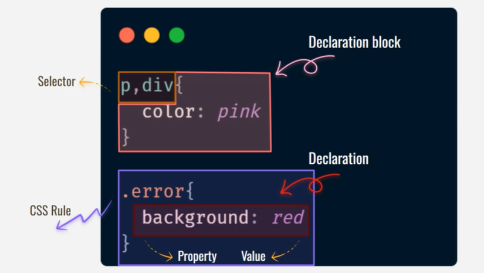
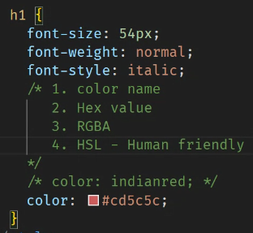
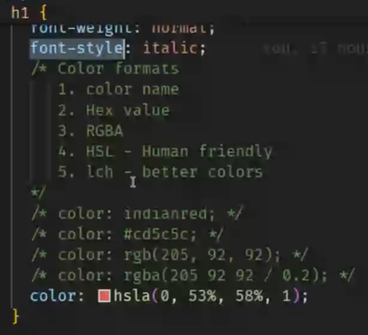
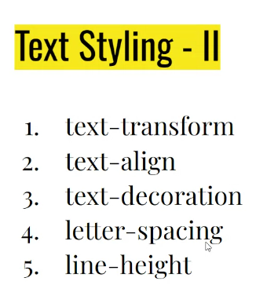
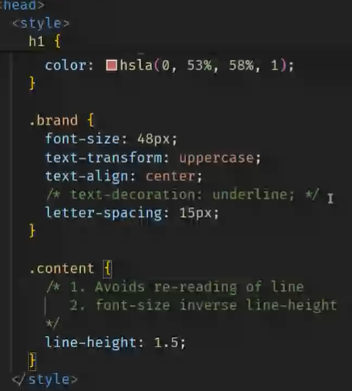

# Types of CSS:

- Internal CSS (consize applications)
- External CSS (Always preffered bcoz of separation of concern & Reusability)
- Inline CSS ( not preffered much bcoz no separation of concern)

# CSS Terminology

# Text styling & color formats

> Font Families

- serif - traditional , trust , secure(has tails in the font)
- sans serif (looks simple and no tails)
