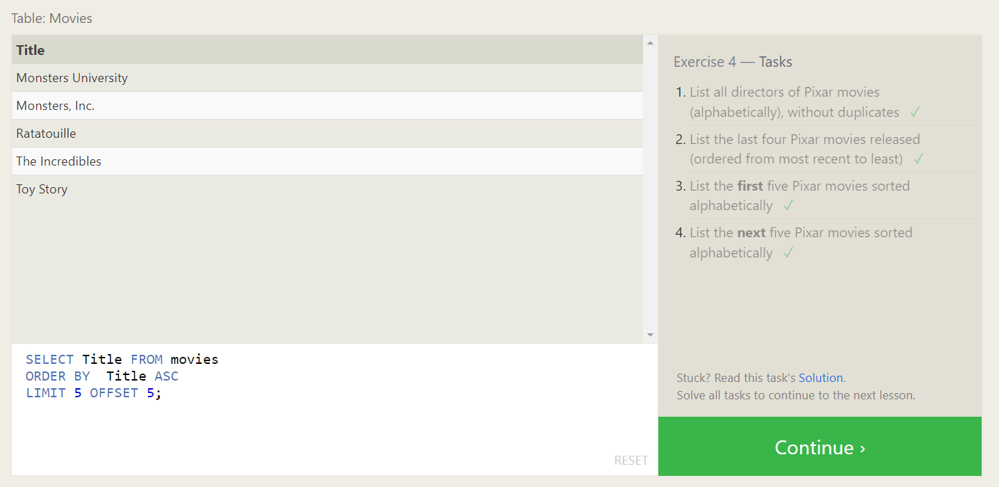
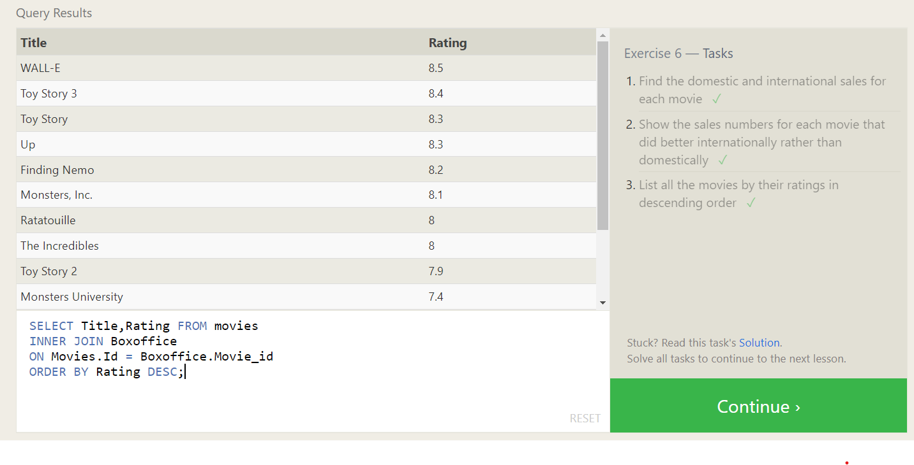
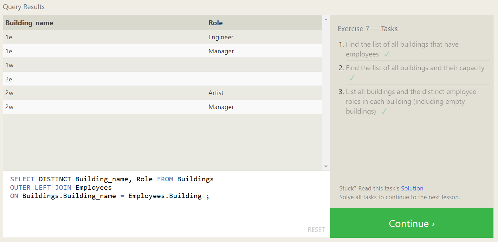
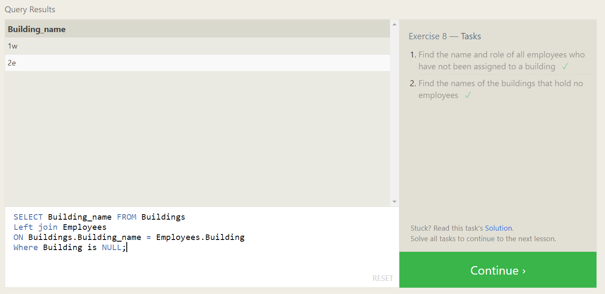
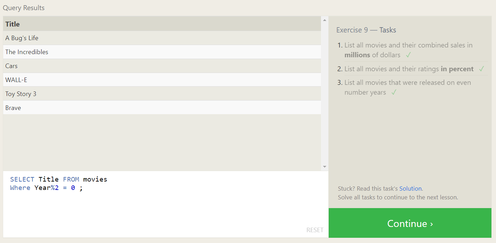

## Exercise 1 — Tasks

Find the title of each film ✓

```sql
 SELECT Title FROM movies;
```

Find the director of each film ✓

```sql
 SELECT Director FROM movies;
```

Find the title and director of each film ✓

```sql
 SELECT Title,Director FROM movies;
```

Find the title and year of each film ✓

```sql
 SELECT Title,year FROM movies;
```

Find all the information about each film ✓

```sql
 SELECT * FROM movies;
```


## Exercise 2 — Tasks

Find the movie with a row id of 6 ✓

```sql
SELECT *
FROM movies
Where id = 6;
```

Find the movies released in the years between 2000 and 2010 ✓

```sql
SELECT * FROM movies
where year between 2000 and 2010;
```

Find the movies not released in the years between 2000 and 2010 ✓

```sql
SELECT * FROM movies
where year not between 2000 and 2010;
```

Find the first 5 Pixar movies and their release year ✓

```sql
SELECT * FROM movies
where id<= 5;
```


## Exercise 3 — Tasks

Find all the Toy Story movies ✓

```sql
SELECT * FROM movies
where title like "Toy Story%";
```

Find all the movies directed by John Lasseter ✓

```sql
SELECT * FROM movies
where director = "John Lasseter";
```

Find all the movies (and director) not directed by John Lasseter ✓

```sql
SELECT * FROM movies
where director != "John Lasseter";
```

Find all the WALL-\* movies ✓

```sql
SELECT * FROM movies
where TITLE like "WALL-_";
```


## Exercise 4 — Tasks

List all directors of Pixar movies (alphabetically), without duplicates ✓

```sql
SELECT  Distinct Director
FROM Movies
ORDER BY Director ASC;
```

List the last four Pixar movies released (ordered from most recent to least) ✓

```sql
SELECT Title FROM movies
ORDER BY Year Desc
LIMIT 4 OFFSET 0;
```

List the first five Pixar movies sorted alphabetically ✓

```sql
SELECT Title FROM movies
ORDER BY  Title ASC
LIMIT 5 OFFSET 0;
```

List the next five Pixar movies sorted alphabetically ✓

```sql
SELECT Title FROM movies
ORDER BY  Title ASC
LIMIT 5 OFFSET 5;
```



## Review 1 — Tasks

List all the Canadian cities and their populations ✓

```sql
SELECT city,population FROM north_american_cities
where country = "Canada";
```

Order all the cities in the United States by their latitude from north to south ✓

```sql
SELECT City FROM north_american_cities
where Country = "United States"
ORDER BY latitude DESC;
```

List all the cities west of Chicago, ordered from west to east ✓

```sql
SELECT City FROM north_american_cities
where longitude < -87.629798
ORDER BY  longitude ASC;
```

List the two largest cities in Mexico (by population) ✓

```sql
SELECT City FROM north_american_cities
where country ="Mexico"
ORDER BY population DESC
LIMIT 2 OFFSET 0;
```

List the third and fourth largest cities (by population) in the United States and their population ✓

```sql
SELECT City FROM north_american_cities
where country ="United States"
ORDER BY population DESC
LIMIT 2 OFFSET 2;
```


## Exercise 6 — Tasks

Find the domestic and international sales for each movie ✓

```sql
SELECT * FROM movies
INNER JOIN Boxoffice
ON Movies.Id = Boxoffice.Movie_id;
```

Show the sales numbers for each movie that did better internationally rather than domestically ✓

```sql
SELECT * FROM movies
INNER JOIN Boxoffice
ON Movies.Id = Boxoffice.Movie_id
where Domestic_sales < International_sales;
```

List all the movies by their ratings in descending order ✓

```sql
SELECT Title,Rating FROM movies
INNER JOIN Boxoffice
ON Movies.Id = Boxoffice.Movie_id
ORDER BY Rating DESC;
```



## Exercise 7 — Tasks

Find the list of all buildings that have employees ✓

```sql
SELECT Distinct Building FROM employees;
```

Find the list of all buildings and their capacity ✓

```sql
SELECT * FROM Buildings;
```

List all buildings and the distinct employee roles in each building (including empty buildings) ✓

```sql
SELECT DISTINCT Building_name, Role FROM Buildings
OUTER LEFT JOIN Employees
ON Buildings.Building_name = Employees.Building ;
```



## Exercise 8 — Tasks

Find the name and role of all employees who have not been assigned to a building ✓

```sql
SELECT Name,Role FROM employees
Where Building is NULL;
```

Find the names of the buildings that hold no employees ✓

```sql
SELECT Building_name FROM Buildings
Left join Employees
ON Buildings.Building_name = Employees.Building
Where Building is NULL;
```



## Exercise 9 — Tasks

List all movies and their combined sales in millions of dollars ✓

```sql
SELECT *,(Domestic_sales+International_sales)/1000000 AS Total_Sales FROM movies
INNER Join Boxoffice
ON Id = Movie_id;
```

List all movies and their ratings in percent ✓

```sql
SELECT Title,(Rating*10) AS Ratings_in_percent FROM movies
INNER Join Boxoffice
ON Id = Movie_id;
```

List all movies that were released on even number years ✓

```sql
SELECT Title FROM movies
Where Year % 2 = 0 ;
```


